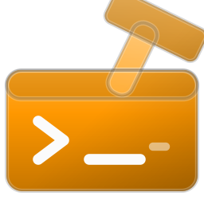

#+title: maak: infinitely extensible command runner
#+author: Josep Bigorra
#+email: jjbigorra@gmail.com
#+options: toc:nil num:nil

[[https://jointhefreeworld.org/ggg/dist/scheme-guile.svg]]  [[https://jointhefreeworld.org/ggg/dist/gnu-guix.svg]]  [[https://jointhefreeworld.org/ggg/dist/maak.svg]]  [[https://jointhefreeworld.org/ggg/dist/license-mit.svg]]
[[https://jointhefreeworld.org/ggg/dist/jointhefreeworld-org.svg]]

#+attr_html: :width 160 :alt maak logo

* Every task is a λ

maak is a command runner, and its task list is a Lisp file. You write =maak.scm=
— a perfectly normal Guile module — and every procedure in it becomes a task you
can name on the command line. There is no DSL to learn and no second language to
keep in your head: the build is the program.

#+begin_src scheme
(define-module (maak)
  #:declarative? #t
  #:use-module (maak maak))

;; A task is a λ: (define (deploy) ...) is (define deploy (lambda () ...)).
(define (deploy)
  "Ship the build to the server."
  (run (list "rsync" "-av" "build/" "server:/srv/www")))

;; Procedures are values, so tasks compose like any other function.
(define (ci)
  "Everything CI does, in order."
  (fmt)
  (test)
  (deploy))
#+end_src

#+begin_src shell
$ maak ci
#+end_src

#+begin_quote
Most build tools invent their own limited domain-specific language.  Maak embraces the powerful *λ Lisp* and the amazing Guile Scheme programming language.

/This also means your code is flexible, robust and reliable (+declarative) for at least the next 50 years./
#+end_quote

* What maak is, in fifteen seconds

- *What it is.* A command runner and control plane. You write a file called ~maak.scm~ — a perfectly normal Guile module — and every function in it becomes a runnable task.
- *Who it is for.* Lispers who want their automation to be as powerful as their editor, and everyone who is tired of Make's runes, shell-script glue, and YAML pipelines that cannot loop.
- *Why it matters.* Tasks are real Scheme functions: composable, testable, declarative, dry-runnable, parallelisable, and reproducible.

* Lisp all the way down

- *The entire language, not a DSL.* Define functions, use lists and hash tables, write macros, import libraries. If you can write it in Guile, you can write it in a task.
- *Lambdas compose.* A task calls another task with a function call, and a list of tasks is a list — no subprocess, no re-parsing a file to find out what to run.
- *Your editor already knows the language.* Docstrings are the task list, the REPL is the development loop, and =maak --list= reads like =apropos=.
- *Guix and Nix are values too.* A pin is a store path a task can decide on, not a string another tool has to interpret.
- *Shell-free by default.* ~run~ takes a program and its arguments as separate strings, so a path with a space in it stays one argument.
- *Errors that read like sentences.* ~task-error~ prints one line and a hint, exits non-zero, and keeps the backtrace behind ~--debug~.

The full list — pipelines, background jobs, ~-j~, containers, niri, downloads,
gettext — is in [[file:docs/features.org][Features]].

* Install in one line

#+begin_src shell
guix install maak
#+end_src

Guix, Nix, the container image, the RPM and the Debian package are all in
[[file:docs/installation.org][Installing maak]]. From a checkout, the launcher
runs this tree's own sources:

#+begin_src shell
guix shell -m manifest.scm -- ./scripts/maak --list
#+end_src

* Editor support

Emacs is the first-class citizen.  [[https://github.com/jjba23/maak.el][maak.el]]
is maak's canonical front end: pick a task, prompt for its arguments, watch the
output and jump to the definition, from inside Emacs, from the same =maak.scm=
the command line runs.

The other editors are also served.  Neovim, Vim, VS Code, Helix,
IntelliJ, Zed and Sublime Text each have an integration in
[[file:contrib/README.org][contrib/]] .

[[file:docs/editors.org][Editors, shells and the REPL]] has the details, and every integration has a README of its own.

* Documentation

The guide is split by topic, so a page stays short enough to read on a phone.
Start with the quick start, or open the whole [[file:docs/index.org][documentation index]].

| Page | What it covers |
|------+----------------|
| [[file:docs/quick-start.org][Quick start]] | Your first Maak file: eight steps from a module to a dry run. |
| [[file:docs/tasks.org][Tasks]] | How a function becomes a task, what exports hide, how arguments arrive. |
| [[file:docs/cli.org][The command line]] | Every option, the grammar of tasks and arguments, =--list= output. |
| [[file:docs/configuration.org][Configuration]] | Environment variables, and the parameters behind dry-run and quiet. |
| [[file:docs/builtins.org][The built-in toolkit]] | =run=, pipelines, jobs, file helpers, =task-error=, gettext. |
| [[file:docs/guix-and-nix.org][Guix, Nix and reproducibility]] | The helpers that build the command line, and the ones that return values. |
| [[file:docs/why-maak.org][Why maak, and why Lisp]] | What Make cannot do, and the table of Make flags that did carry over. |
| [[file:docs/editors.org][Editors, shells and the REPL]] | maak.el and the seven integrations, the shell completions, the REPL workflow. |

The manual page is installed with the program (~man maak~, or ~maak man~ in a
checkout), the technical Guile API documentation is published at
https://jointhefreeworld.org/api-docs/maak/API.html, and every release is
recorded in [[file:NEWS.org][NEWS.org]].

* Who uses maak

maak runs the build, release and site automation of many projects, see a list in
[[file:docs/who-uses-maak.org][Who uses maak]].

Using maak in your project? Send a link and it can be listed there.

* Community and support

- *Issues and development:* [[https://codeberg.org/jjba23/maak][the Codeberg repository]]; the backlog and Kanban boards live at https://lucidplan.jointhefreeworld.org/tickets/maak.
- *Chat, support, discussion, announcements:* [[https://jointhefreeworld.zulipchat.com/#narrow/channel/632494-maak][the maak Zulip community]].

Bug reports, patches, the AI policy and the code of conduct are in
[[file:docs/community.org][Community, contributing and conduct]]. If you like
this work, you can [[https://bmc.link/jjbigorra][buy me a cup of coffee ☕]] so I
can keep going with a lot of motivation.

* License

maak, and all of its source code, build files and documentation — this document included — are free software, licensed under the *MIT License* (MIT).

https://opensource.org/license/mit

The full text is in the =LICENSE= file shipped with the source.

In short: use it, study it, change it, share it — and keep the copyright notice and the permission notice with the copies you pass on.

-------

Happy hacking! ✨
